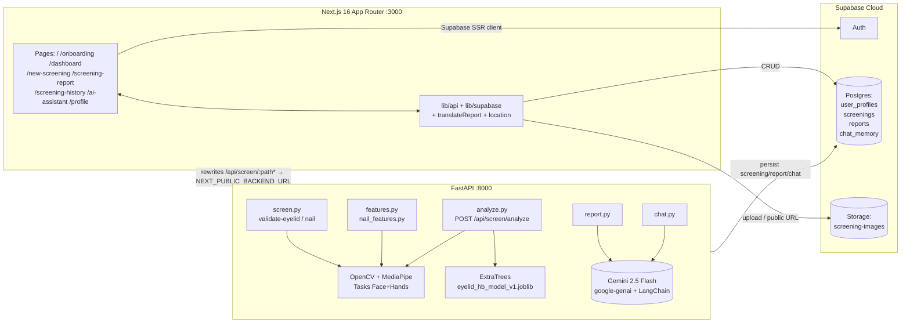
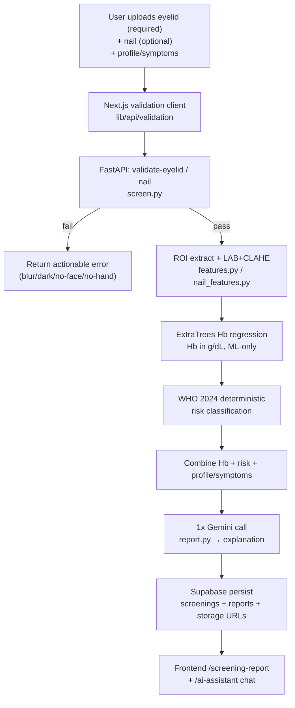
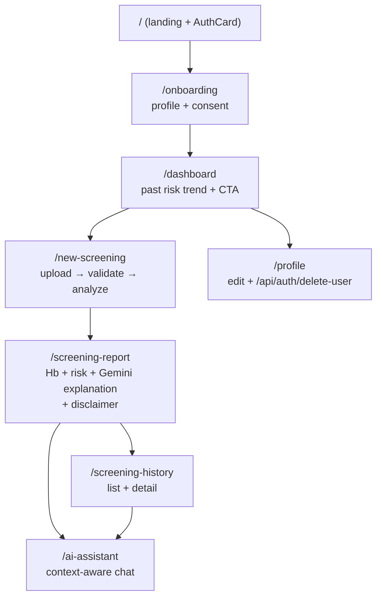

# HemoLens — AI-Powered Preliminary Anemia Screening

[](https://nextjs.org/)
[](https://react.dev/)
[](https://fastapi.tiangolo.com/)
[](https://supabase.com/)
[](https://ai.google.dev/)
[]()

> **⚠️ Medical Disclaimer — Read First**
> HemoLens is a **preliminary wellness screening tool, NOT a medical diagnosis**.
> It estimates anemia *risk* from eyelid (+ optional nail) images and self-reported context.
> It does **not** replace a venous blood draw / CBC. Any concerning result should be
> followed up with a qualified clinician and confirmatory lab testing.

HemoLens combines computer vision, ML hemoglobin regression, deterministic WHO-2024
risk rules, and one Gemini call for an explainable report — plus a context-aware AI assistant.

> **🏆 Hackathon Prototype — Grand Hack IPEC 2026**
> This project was built overnight during the **24-hour Grand Hack IPEC 2026 hackathon**.
> It is a **prototype / proof-of-concept for demonstration only — not deployed**,
> not production-hardened, and not intended for real clinical use.

**Pipeline in one line:**

> Image(s) → OpenCV / MediaPipe validate → ROI extract → LAB + CLAHE normalize →
> ML Hb regression (ExtraTrees) → WHO 2024 deterministic risk classification →
> \+ profile / symptoms → 1× Gemini call for report → Supabase persist →
> frontend report + context-aware chat.

**LLM discipline:**

- `0` LLM calls during inference (Hb + risk are fully deterministic / ML-only).
- `1` LLM call for the human-readable report.
- `1` LLM call per chat message.
- The LLM **never computes Hb or risk** — it only explains pre-computed values.

---

## Table of Contents

- [Features](#features)
- [Architecture](#architecture)
- [Monorepo Structure](#monorepo-structure)
- [Tech Stack](#tech-stack)
- [Getting Started](#getting-started)
- [API Quick Reference](#api-quick-reference)
- [Supabase Schema Summary](#supabase-schema-summary)
- [Testing \& Quality](#testing--quality)
- [Scripts](#scripts)
- [Deployment](#deployment)
- [UI Design Notes](#ui-design-notes)
- [Limitations \& Non-Goals](#limitations--non-goals)
- [Contributing](#contributing)
- [Docs \& Links](#docs--links)

---

## Features

- **Lower-eyelid (palpebral conjunctiva) screening — mandatory primary input.**
  Face-mesh guided ROI extraction, blur / lighting / resolution validation.
- **Nail-bed image — optional secondary signal.** Hand-landmark guided ROI.
- **Deterministic inference pipeline:**
  OpenCV-Headless + NumPy + MediaPipe Tasks (Face + Hands) →
  LAB + CLAHE normalization → scikit-learn ExtraTrees Hb regressor
  (`eyelid_hb_model_v1.joblib`) → WHO 2024 rule-based risk tier.
- **Personalized context:** age, sex, pregnancy status, symptoms, history feed
  into risk adjustment and the Gemini report prompt — not into Hb regression.
- **AI report (1 Gemini call):** risk explanation, likely contributors,
  next steps, confirmatory-test nudge. Bilingual EN / Hindi.
- **AI assistant chat:** report-aware, screening-history-aware follow-up Q&A.
- **Supabase persistence:** auth, `user_profiles`, `screenings`, `reports`,
  `chat_memory`, `screening-images` storage bucket.
- **Full screening flow UI:** landing + `AuthCard` → onboarding → dashboard →
  new-screening → screening-report → screening-history → ai-assistant → profile.
- **Bilingual UI:** custom `LanguageContext` + `locales/en.json` + `locales/hi.json`
  (no next-intl / next-i18n-router dependency).
- **Route protection:** `middleware.ts` Supabase session + route guards.

---

## Architecture

### 1. System architecture



### 2. Data flow (canonical screening)



### 3. Frontend screening UX flow



---

## Monorepo Structure

| Path | What lives there |
|------|------------------|
| `app/` | Next.js 16.3.5 App Router, React 19.2.8, TS5 strict. Routes: `/`, `/onboarding`, `/dashboard`, `/new-screening`, `/screening-report`, `/screening-history`, `/ai-assistant`, `/profile`, `/api/auth/delete-user`. See [app/README.md](app/README.md). |
| `backend/` | FastAPI on `:8000`. OpenCV-headless + NumPy + MediaPipe Tasks (Face + Hands), scikit-learn ExtraTrees bundle `eyelid_hb_model_v1.joblib`, Supabase persistence, Gemini `google-genai` + LangChain. See [backend/README.md](backend/README.md). |
| `lib/` | Shared frontend logic: `lib/supabase/{client,server,middleware,auth,screenings,reports,reportResult}`, `lib/api/{validation,screeningAnalysis,assistant,eyelidFeatures,nailFeatures}`, `lib/utils/translateReport`, `lib/location`. |
| `supabase/migrations/` | 8 migrations: `user_profiles`, `delete_user_rpc`, `screenings` + `screening-images` bucket, `reports`, ROI columns, `chat_memory` ×3. |
| `types/database.types.ts` | Supabase generated TS types. |
| `locales/en.json`, `locales/hi.json` | Custom i18n strings via `LanguageContext` (EN / Hindi). |
| `public/assets/` | Static images / icons. |
| `middleware.ts` | Supabase session refresh + route guards. |
| `docs/HEMOLENS.md` | Product spec / decisions. See [docs/HEMOLENS.md](docs/HEMOLENS.md). |
| `docs/PIPELINE.md` | ML/CV pipeline deep-dive. See [docs/PIPELINE.md](docs/PIPELINE.md). |
| `test_validator.py` | Root quick-runner for image validator smoke test. |
| `next.config.ts` | `rewrites /api/screen/:path* → NEXT_PUBLIC_BACKEND_URL` (default `http://127.0.0.1:8000`); `images.remotePatterns` for Supabase Storage public URLs. |
| `package.json` | `hemolens@0.1.0`. Scripts `dev` / `build` / `start` / `lint`. |

---

## Tech Stack

### Frontend (`app/` + `lib/`)

| Layer | Choice |
|-------|--------|
| Framework | Next.js 16.3.5 App Router, React 19.2.8, TypeScript 5 strict |
| Styling | Tailwind CSS v4 (no `tailwind.config`, CSS-first `@import "tailwindcss"`), custom palette (see [UI Design Notes](#ui-design-notes)) |
| UI / motion | `lucide-react` icons, `framer-motion`, `next/font` Inter |
| i18n | Custom `LanguageContext` + `locales/en.json` + `locales/hi.json` (no shadcn, no next-intl) |
| Data | Supabase SSR (`@supabase/ssr`, `@supabase/supabase-js`), fetch to FastAPI via Next rewrites |
| Auth guards | `middleware.ts` + `lib/supabase/*` |

### Backend (`backend/`)

| Layer | Choice |
|-------|--------|
| API | FastAPI, Uvicorn `[standard]`, `python-multipart`, Pydantic, `python-dotenv` |
| Vision | `opencv-python-headless`, `numpy`, `mediapipe==0.10.35`, `protobuf` |
| ML | `scikit-learn`, `joblib`, bundle `eyelid_hb_model_v1.joblib` (ExtraTrees Hb regressor) |
| AI text | `google-genai` (Gemini), `langchain` orchestration for report/chat prompts |
| Persistence | `supabase` Python client (service-role server-side only) |

### Infra / services

| Service | Use |
|---------|-----|
| Supabase Cloud | Auth, Postgres, Storage (`screening-images` bucket) |
| Vercel | Frontend hosting (recommended) |
| Render / Railway | Backend hosting (recommended) |
| Gemini | `GEMINI_MODEL=gemini-2.5-flash` report + chat generation only |

---

## Getting Started

### Prerequisites

- Node.js 20+ and npm
- Python 3.10+ (3.11 recommended)
- Supabase project (URL + anon key; service-role key for backend only)
- Gemini API key (`GEMINI_API_KEY`)
- Git remote: `https://github.com/aryandas2911/HemoLens.git`, branch `master`

### 1. Frontend (Next.js)

```bash
npm install
cp .env.example .env.local
# edit .env.local — see env table below
npm run dev
# open http://localhost:3000
```

### 2. Backend (FastAPI)

```bash
pip install -r backend/requirements.txt
uvicorn backend.main:app --reload --port 8000
# health: http://localhost:8000/docs (FastAPI Swagger)
```

Frontend calls the backend via Next rewrites — set
`NEXT_PUBLIC_BACKEND_URL=http://localhost:8000` (or `http://127.0.0.1:8000`)
so `/api/screen/:path*` proxies correctly. `next.config.ts` already handles this;
no CORS hack needed in dev.

Key backend deps (`backend/requirements.txt`):
`fastapi`, `uvicorn[standard]`, `python-multipart`, `python-dotenv`, `pydantic`,
`google-genai`, `opencv-python-headless`, `numpy`, `mediapipe==0.10.35`,
`protobuf`, `scikit-learn`, `joblib`, `supabase`, `langchain`, etc.

### 3. Supabase

```bash
# with Supabase CLI linked to your project
supabase db push
```

This applies all 8 migrations in `supabase/migrations/`:
`user_profiles`, `delete_user_rpc`, `screenings` + storage bucket
`screening-images`, `reports`, ROI columns, `chat_memory` ×3.
Also ensure the `screening-images` bucket is public-readable (or signed URLs)
so `next.config.ts` `images.remotePatterns` can render stored ROIs.

### 4. Environment variables

Copy `.env.example` → `.env.local` (frontend) and backend `.env` as needed.
Never commit real keys.

| Key | Where | Public? | Purpose / default |
|-----|-------|---------|-------------------|
| `NEXT_PUBLIC_SUPABASE_URL` | frontend | ✅ public (anon-safe) | Supabase project URL |
| `NEXT_PUBLIC_SUPABASE_ANON_KEY` | frontend | ✅ public (anon-safe, RLS enforced) | Supabase anon key |
| `SUPABASE_SERVICE_ROLE_KEY` | backend only | 🔒 secret — never expose to client | Bypass RLS for server persistence (commented in example) |
| `GEMINI_API_KEY` | backend only | 🔒 secret | Gemini report / chat generation |
| `GEMINI_MODEL` | backend | ⚙️ config | Default `gemini-2.5-flash` |
| `NEXT_PUBLIC_BACKEND_URL` | frontend | ⚙️ config | Default `http://localhost:8000` (or `http://127.0.0.1:8000`); rewrite target for `/api/screen/:path*` |

---

## API Quick Reference

Base in dev: Next.js rewrite `/api/screen/*` → FastAPI. Canonical analyze route is
`POST /api/screen/analyze`. Full router docs: [backend/README.md](backend/README.md).

| Method + Path | Router | Purpose |
|---------------|--------|---------|
| `POST /api/screen/validate-eyelid` | `backend/routers/screen.py` | Validate lower-eyelid image (face present, ROI found, blur/lighting/resolution checks) |
| `POST /api/screen/validate-nail` | `backend/routers/screen.py` | Validate nail-bed image (hand present, ROI found, quality checks) |
| `POST /api/screen/eyelid-features` | `backend/routers/features.py` | ROI + LAB+CLAHE features debug / preview (eyelid) |
| `POST /api/screen/nail-features` | `backend/routers/nail_features.py` | ROI + features debug / preview (nail) |
| `POST /api/screen/analyze` | `backend/routers/analyze.py` | **Canonical screening:** validate → ROI → normalize → ExtraTrees Hb → WHO-2024 risk → persist, return Hb + risk + IDs |
| `POST /api/screen/report` | `backend/routers/report.py` | 1× Gemini call: explain pre-computed Hb/risk with profile/symptoms context; persist to `reports` |
| `POST /api/screen/chat` | `backend/routers/chat.py` | Context-aware follow-up chat (1 LLM call/message, history from `chat_memory`) |
| `DELETE /api/auth/delete-user` | `app/api/auth/delete-user` (Next.js) | Delete auth user via `delete_user_rpc` + cleanup |

Frontend wrappers: `lib/api/validation`, `lib/api/screeningAnalysis`,
`lib/api/assistant`, `lib/api/eyelidFeatures`, `lib/api/nailFeatures`.

---

## Supabase Schema Summary

| Table / object | Purpose | Key columns |
|----------------|---------|-------------|
| `user_profiles` | Onboarding profile per auth user | `user_id` (FK auth), age, sex, pregnancy, comorbidities, locale (`en`/`hi`) |
| `screenings` | One row per `POST /analyze` | `id`, `user_id`, `eyelid_image_url`, `nail_image_url?`, `hb_estimate`, `risk_tier`, ROI columns (`roi_*`), model version, created_at |
| `reports` | One Gemini report per screening | `id`, `screening_id` (FK), `report_markdown_en` / `_hi`, `model`, created_at |
| `chat_memory` | Per-user assistant history (3 migrations evolve this) | `id`, `user_id`, `screening_id?`, `role`, `content`, created_at |
| Storage `screening-images` | Original + ROI images | Public-read bucket; URLs stored on `screenings` |
| `delete_user_rpc` | Secure account deletion | Postgres function invoked by `DELETE /api/auth/delete-user` |

Types: `types/database.types.ts`. Migrations: `supabase/migrations/` (8 files).

---

## Testing & Quality

```bash
# Fast image-validator smoke test (root runner)
python test_validator.py

# Backend tests
pytest backend/tests -v

# Frontend
npm run lint
npx tsc --noEmit
npm run build
```

- `test_validator.py` exercises the OpenCV/MediaPipe validator without booting the full stack.
- `pytest backend/tests -v` covers routers / pipeline regressions.
- `npm run lint` + `npx tsc --noEmit` + `npm run build` are required before PRs
  (per project convention: lint → typecheck → build).

---

## Scripts

| Command | Where | What it does |
|---------|-------|--------------|
| `npm run dev` | root (`hemolens@0.1.0`) | Next.js dev on `:3000` |
| `npm run build` | root | Production build (also runs typecheck) |
| `npm run start` | root | Serve production build |
| `npm run lint` | root | ESLint |
| `uvicorn backend.main:app --reload --port 8000` | backend | FastAPI dev with Swagger at `/docs` |
| `pip install -r backend/requirements.txt` | backend | Install Python deps |
| `supabase db push` | repo root | Apply `supabase/migrations/` |
| `python test_validator.py` | repo root | Validator smoke test |
| `pytest backend/tests -v` | repo root | Backend test suite |

---

## Deployment

> **Not deployed** — hackathon prototype only (Grand Hack IPEC 2026, 24-hour build).
> The table below is the intended deployment plan, retained for reference.

| Piece | Recommended | Notes |
|-------|-------------|-------|
| Frontend | Vercel | Import repo, set `NEXT_PUBLIC_SUPABASE_URL`, `NEXT_PUBLIC_SUPABASE_ANON_KEY`, `NEXT_PUBLIC_BACKEND_URL` (prod FastAPI URL). Rewrites in `next.config.ts` handle `/api/screen/*` proxying. |
| Backend | Render / Railway | Start command `uvicorn backend.main:app --host 0.0.0.0 --port $PORT`. Set `SUPABASE_SERVICE_ROLE_KEY`, `GEMINI_API_KEY`, `GEMINI_MODEL`. Ensure MediaPipe + OpenCV-headless wheels are supported (use Python 3.11 image). |
| Data | Supabase Cloud | Run `supabase db push`; create / confirm `screening-images` bucket + RLS policies; store URLs allowlisted in `next.config.ts` `images.remotePatterns`. |

Local prod check: `npm run build; npm run start` + backend without `--reload`.

---

## UI Design Notes

- Palette anchored on primary **`#bf191d`** (hemoglobin red) with neutral
  backgrounds and high-contrast text; success / warning / danger tiers map to
  WHO risk bands. Keep landing-page tokens as source of truth for new pages.
- Tailwind v4 CSS-first (no `tailwind.config.js`, no shadcn). Utility classes +
  CSS variables only.
- Typography: `next/font` Inter, system fallback.
- Icons: `lucide-react`; motion: `framer-motion` (subtle, accessibility-aware).
- Bilingual: every user-facing string must exist in both `locales/en.json` and
  `locales/hi.json`; `translateReport` handles report markdown translation.

---

## Limitations & Non-Goals

- **Not a diagnosis.** Pallor correlates imperfectly with Hb; lighting, makeup,
  camera ISP, and image compression all shift estimates. Confirmatory CBC required.
- **Eyelid quality-sensitive.** Fails closed when no face / ROI, heavy blur,
  or extreme under/over-exposure is detected — this is intentional.
- **Nail is secondary only.** Never used standalone for a screening decision.
- **Model scope:** single ExtraTrees regressor (`eyelid_hb_model_v1`) trained on
  a limited dataset — expect bias across skin tones / devices until retrained on
  broader data. Version your model artifacts.
- **Non-goals:** no treatment prescription, no emergency triage, no storage of
  raw identifiable face photos beyond the consented screening ROI flow,
  no LLM-computed vitals.
- **Privacy:** images go to Supabase Storage + FastAPI inference; delete account
  via Profile → delete (calls `/api/auth/delete-user`).

---

## Contributing

- Branch from `master` (`https://github.com/aryandas2911/HemoLens.git`).
- Keep PRs small; run `npm run lint`, `npx tsc --noEmit`, `npm run build`,
  and `pytest backend/tests -v` before requesting review.
- Match landing-page UI tokens (primary `#bf191d`, Tailwind v4, Inter,
  lucide icons) on any new screen.
- Bilingual rule: add both `en.json` and `hi.json` strings.
- Never commit `.env.local` / secrets; update `.env.example` if keys change.
- Update `docs/HEMOLENS.md` for product decisions and `types/database.types.ts`
  after schema changes.

---

## Docs & Links

- Frontend routes & components: [app/README.md](app/README.md)
- Backend routers & pipeline: [backend/README.md](backend/README.md)
- Product spec / decisions: [docs/HEMOLENS.md](docs/HEMOLENS.md)
- ML/CV pipeline deep-dive: [docs/PIPELINE.md](docs/PIPELINE.md)
- Live repo: `https://github.com/aryandas2911/HemoLens.git` (branch `master`)
- Supabase migrations: `supabase/migrations/` (8 files)
- Env template: `.env.example`
