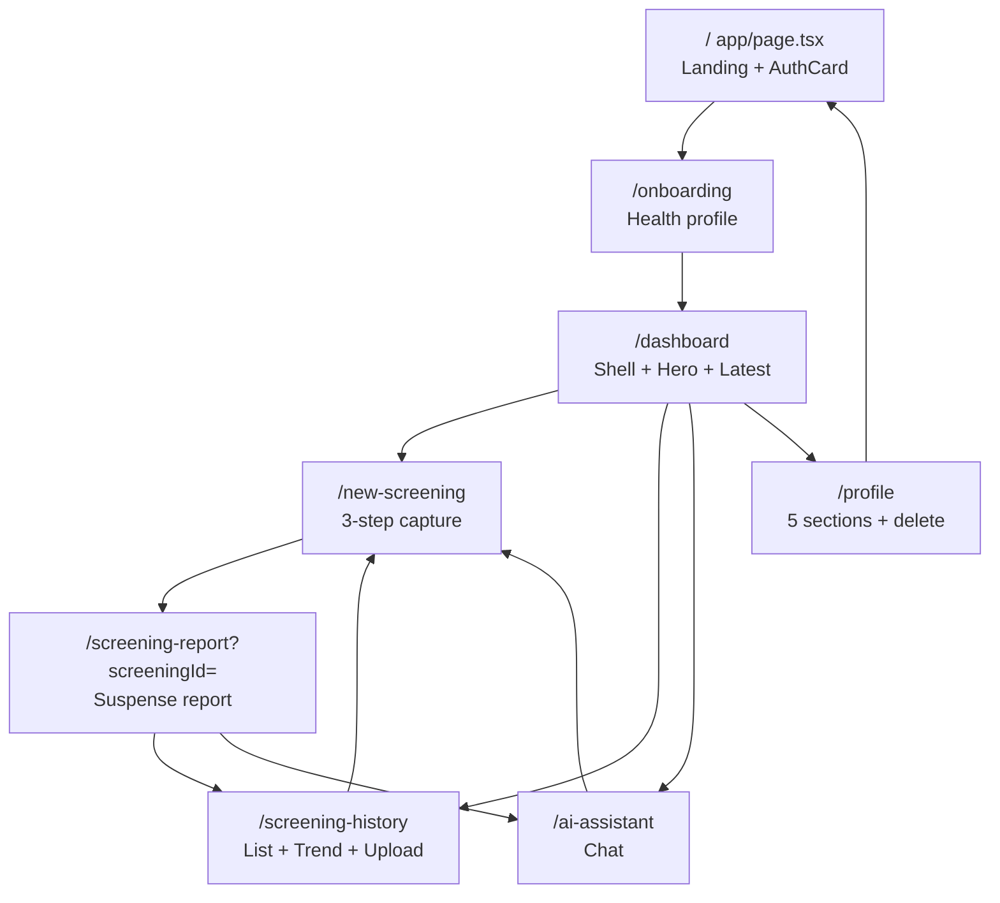
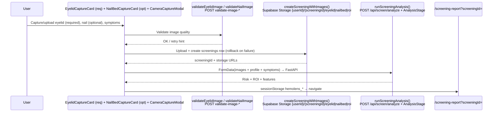
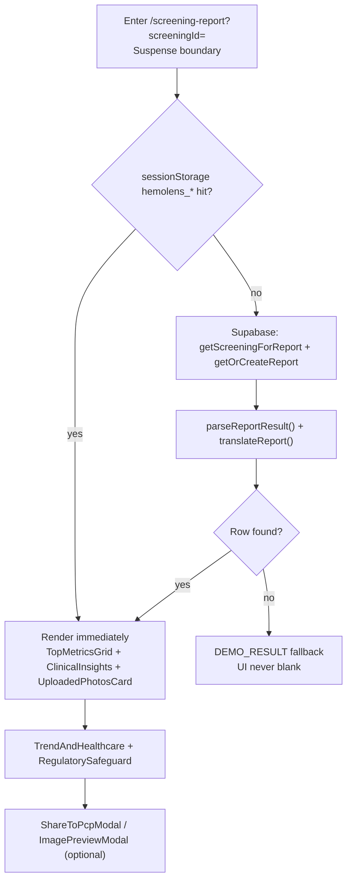
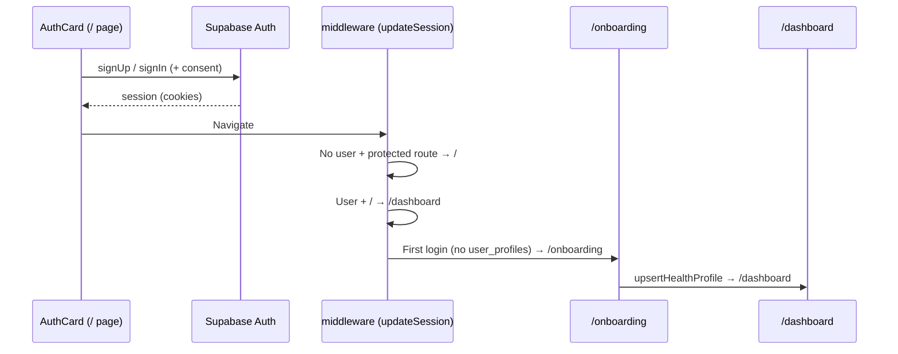

# HemoLens Frontend (`app/`)

Next.js App Router frontend for HemoLens — preliminary anemia screening from a lower-eyelid photo (primary) + optional nail-bed photo, with health-profile personalization, screening report, history/trends, and AI health assistant.

> Root docs: [../README.md](../README.md) · Backend: [../backend/README.md](../backend/README.md) · Data client: [../lib](../lib) · DB/migrations: [../supabase](../supabase) · Extra docs: [../docs](../docs)
>
> Safety copy (shown throughout UI): **preliminary screening, not a diagnosis — confirm with a blood test / clinician.**

---

## 1. Overview

- **Landing + auth (`/`)**: split layout — marketing/education left (`Header` + `ScreeningFlow` + `FeaturesGrid` + `Footer`), auth right (`AuthCard`).
- **Onboarding (`/onboarding`)**: health profile form → upsert to `user_profiles` → `/dashboard`.
- **Dashboard (`/dashboard`)**: sidebar app shell, hero banner, quick actions, latest screening.
- **New screening (`/new-screening`)**: 3-step capture flow (eyelid required, nail-bed optional, symptoms) → Supabase Storage upload → FastAPI analysis → `/screening-report?screeningId=`.
- **Report (`/screening-report`)**: metrics, clinical insights, photos, trend/healthcare actions, safeguards, share-to-PCP, session-cache-first with Supabase fallback + `DEMO_RESULT` fallback.
- **History (`/screening-history`)**: list, trend, medical-report upload, clinical help CTA.
- **AI assistant (`/ai-assistant`)**: chat UI with memory + screening-history context.
- **Profile (`/profile`)**: 5-section editor + danger-zone delete (type `delete` to confirm).
- **API bridge (`/api/*`)**: `next.config.ts` rewrites `/api/screen/:path*` → FastAPI; local route `/api/auth/delete-user` handles account deletion.

---

## 2. Tech Stack

| Layer | Choice | Notes |
|---|---|---|
| Framework | Next.js `16.3.5` App Router | `app/layout.tsx` root layout, per-route `page.tsx` |
| UI | React `19.2.8`, TypeScript `5` strict | Path alias `@/*` → `./*` |
| Styling | Tailwind CSS `v4` | `@import "tailwindcss"` in `app/globals.css`, `@theme inline` tokens; **no `tailwind.config`, no shadcn** |
| Icons / motion / font | `lucide-react`, `framer-motion`, `next/font` Inter | `Inter({ variable: "--font-inter" })` |
| Auth / DB / Storage | `@supabase/ssr` + `@supabase/supabase-js` | Browser client, server client (cookies), middleware session |
| Backend proxy | `next.config.ts` rewrites | `/api/screen/:path*` → `NEXT_PUBLIC_BACKEND_URL` (default `127.0.0.1:8000`) |
| i18n | Custom `LanguageContext` + `locales/en.json`, `locales/hi.json` | `t()` dot-lookup, `localStorage hemolens_lang` |
| Media | `public/assets/` (logo, favicon, `exampleEyelid`, `exampleNailBed`), `public/test-images/` (gitignored) | Example captures shown in capture cards |

---

## 3. Design System

Source: `app/globals.css`.

### 3.1 Tokens (`@theme inline`)

| Token | Value | Usage |
|---|---|---|
| `--color-primary` | `#bf191d` | Primary CTA, brand, active nav |
| `--color-primary-dark` | `#9a1417` | Hover / gradient end |
| `--color-primary-light` | `#e8363a` | Gradient start / highlights |
| `--color-accent` | `#c5feff` | Accent backgrounds, info chips |
| `--color-accent-dark` | `#0d9488` | Teal actions, success-adjacent |
| `--color-heading` | `#0f172a` | Headings (`foreground` same) |
| `--color-surface` | `#f8fafc` | Page background for app shell |
| `--color-border` | `#e2e8f0` | Card borders, dividers |
| `--color-muted` | `#64748b` | Secondary text, placeholders |
| `--font-sans` | `var(--font-inter)` | Inter via `next/font`, antialiased body |

Typography: Inter only; headings `text-heading font-bold`, body default `foreground`, muted `text-muted`. No custom font config beyond `next/font`.

### 3.2 Keyframes / animations

| Token | Keyframe | Used for |
|---|---|---|
| `--animate-float` | `float 6s ease-in-out infinite` | Hero illustrations, floating cards |
| `--animate-pulse-dot` | `pulse-dot 2s ease-in-out infinite` | Live/status dots |
| `--animate-scan-line` | `scan-line 3s ease-in-out infinite` | Camera capture scan effect |
| `--animate-fade-in-up` | `fade-in-up 0.6s ease-out both` | Page/section entrance |
| `--animate-shimmer` | `shimmer 2.5s ease-in-out infinite` | Loading skeletons |
| `--animate-chat-bubble` | `chat-bubble 2s ease-in-out infinite` | Assistant typing indicator |

### 3.3 Layout pattern (authenticated pages)

```
<Sidebar fixed left, w-64 / collapsed w-20, mobile drawer />
<div class="lg:pl-64 | lg:pl-20">   <!-- offset matches SidebarContext.isCollapsed -->
  <DashboardHeader breadcrumb />
  <main class="max-w-* mx-auto px-4 ..."> page content </main>
</div>
```

Landing (`/`) intentionally breaks this pattern: full-width split marketing + `AuthCard`.

Refer to `app/page.tsx` (landing) for brand style when building new components/pages — same palette, rounded-2xl cards, `border-border`, `bg-surface` sections.

---

## 4. Routes

### 4.1 Route map



### 4.2 Routes table

| Route | File | Layout | Purpose |
|---|---|---|---|
| `/` | `app/page.tsx` | Split landing | `Header` + `ScreeningFlow` + `FeaturesGrid` + `Footer` (left), `AuthCard` (right) |
| `/onboarding` | `app/onboarding/page.tsx` | Centered form shell + `OnboardingHeader/Footer` | Collect health profile → `/dashboard` |
| `/dashboard` | `app/dashboard/page.tsx` | `Sidebar` + `DashboardHeader` + `max-w-6xl` | `HeroBanner` + `QuickActionCards` + `LatestScreening` |
| `/new-screening` | `app/new-screening/page.tsx` | `Sidebar` + `DashboardHeader` | `EyelidCaptureCard` (required) + `NailBedCaptureCard` (optional) + `ScreeningSymptomsCard` + `ScreeningBottomBar` + `CameraCaptureModal` |
| `/screening-report` | `app/screening-report/page.tsx` | `Sidebar` + `DashboardHeader`, `Suspense` | `ReportHeader`, `TopMetricsGrid`, `ClinicalInsights`, `UploadedPhotosCard`, `TrendAndHealthcare`, `RegulatorySafeguard`, `ShareToPcpModal`, `ImagePreviewModal` |
| `/screening-history` | `app/screening-history/page.tsx` | `Sidebar` + `DashboardHeader` | `HistoryHeader`, `PreviousScreeningsList`, `TrendAndClinicalHelp`, `HistoryImportantNote`, `UploadMedicalReportModal` |
| `/ai-assistant` | `app/ai-assistant/page.tsx` | `Sidebar` + `DashboardHeader` | `ChatContextBanner` + `ChatMessageList` + `SuggestedPrompts` + `ChatInputBar` + `ChatDisclaimer` |
| `/profile` | `app/profile/page.tsx` (~761 lines) | `Sidebar` + `DashboardHeader`, 5 sections | View/edit profile + delete account (`type delete` → `deleteUserAccount`) |
| `/api/auth/delete-user` | `app/api/auth/delete-user/route.ts` | Route handler (POST) | Verify user → `rpc(delete_user)` → `admin.deleteUser` → fallback row delete → `signOut` |

### 4.3 Per-route flow

- **`/`**: unauthenticated entry. `AuthCard` has signup/login tabs + consent checkbox + non-functional language dropdown (display only; real switcher is `LanguageSwitcher` EN/Hindi). Auth success → middleware decides `/dashboard` vs `/onboarding`.
- **`/onboarding`**: colocated cards — `BasicInfoCard`, `HealthNutritionCard`, `PrimaryCareCard`, `SymptomsCard`, `PregnancyCard`, `LocationCard` (+ `OnboardingHeader/Footer`). Uses `upsertHealthProfile` + `location.ts` (geolocation → Nominatim → `ipapi` → `ipwho` fallbacks). Submit → `/dashboard`.
- **`/dashboard`**: fetches `getCurrentUser` + `getUserScreenings` (latest for `LatestScreening`). `QuickActionCards` link to new-screening / history / assistant.
- **`/new-screening`**: see §5. Session keys `hemolens_*` in `sessionStorage` carry images/result to report page.
- **`/screening-report`**: see §6. Cache-first: `sessionStorage` → `getScreeningForReport` + `getOrCreateReport` + `parseReportResult` → `DEMO_RESULT` fallback so UI never blanks.
- **`/screening-history`**: `getUserScreeningHistory` + `PreviousScreeningsList`; `UploadMedicalReportModal` for lab PDFs/images; trend chart + clinical-help CTA.
- **`/ai-assistant`**: `sendChatMessage(sessionId)` with `Bearer` token; context from `getChatMemory` + `getUserScreeningHistory`. `SuggestedPrompts` for first-run.
- **`/profile`**: 5 sections (account, basic, health/nutrition, care/location, preferences). Delete flow requires typing `delete`, calls `deleteUserAccount`, then POST `/api/auth/delete-user`.

---

## 5. Screening Flow (`/new-screening`)



State: `CameraCaptureModal` handles getUserMedia; `ScreeningSymptomsCard` collects symptom checkboxes; `ScreeningBottomBar` gates Next/Analyze on eyelid-valid. `uploadRoiImageAndUpdateScreening` persists ROI overlay post-analysis. Helpers: `lib/api/eyelidFeatures.ts`, `lib/api/nailFeatures.ts` for ROI crop/preview.

---

## 6. Report Flow (`/screening-report`)



Components: `ReportHeader` (risk badge + date), `TopMetricsGrid` (risk %, Hb estimate, confidence), `ClinicalInsights` (feature explanations), `UploadedPhotosCard` (eyelid/nail/ROI with `ImagePreviewModal`), `TrendAndHealthcare` (history sparkline + find-care CTA), `RegulatorySafeguard` (preliminary-screening disclaimer), `ShareToPcpModal` (share summary).

---

## 7. Components Inventory

### 7.1 Shared (`app/components/`)

| Component | Props / notes |
|---|---|
| `AuthCard` | Signup/login tabs, consent checkbox, lang dropdown (non-functional display) |
| `Sidebar` | `w-64` / collapsed `w-20`, mobile drawer; nav: Dashboard / New Screening / History / Assistant / Profile / Logout; driven by `SidebarContext` |
| `DashboardHeader` | Breadcrumb + user chip; used by all authenticated pages |
| `Header` / `Footer` | Landing header/nav + footer links |
| `FeaturesGrid` / `FeatureCard` | Landing feature grid |
| `ScreeningFlow` | Landing 3-step explainer |
| `LanguageSwitcher` | EN/Hindi toggle (real switcher; `AuthCard` dropdown is visual only) |

### 7.2 Colocated (per-route folders)

- `app/onboarding/`: `OnboardingHeader`, `OnboardingFooter`, `BasicInfoCard`, `HealthNutritionCard`, `PrimaryCareCard`, `SymptomsCard`, `PregnancyCard`, `LocationCard`.
- `app/dashboard/`: `Sidebar` reuse + `DashboardHeader` + `HeroBanner` + `QuickActionCards` + `LatestScreening`.
- `app/new-screening/`: `EyelidCaptureCard`, `NailBedCaptureCard`, `ScreeningSymptomsCard`, `ScreeningBottomBar`, `CameraCaptureModal`.
- `app/screening-report/`: `ReportHeader`, `TopMetricsGrid`, `ClinicalInsights`, `UploadedPhotosCard`, `TrendAndHealthcare`, `RegulatorySafeguard`, `ShareToPcpModal`, `ImagePreviewModal`.
- `app/screening-history/`: `HistoryHeader`, `PreviousScreeningsList`, `TrendAndClinicalHelp`, `HistoryImportantNote`, `UploadMedicalReportModal`.
- `app/ai-assistant/`: `ChatContextBanner`, `ChatMessageList`, `SuggestedPrompts`, `ChatInputBar`, `ChatDisclaimer`.

### 7.3 Context (`app/context/`)

| Provider | File | State |
|---|---|---|
| `LanguageProvider` | `app/context/LanguageContext.tsx` | `en \| hi`, `t()` dot-lookup into `locales/*`, persists `hemolens_lang` |
| `SidebarProvider` | `app/context/SidebarContext.tsx` | `isCollapsed`, persists to `localStorage` |

`app/layout.tsx`: `RootLayout` with metadata + `next/font` Inter → `<LanguageProvider><SidebarProvider>{children}</SidebarProvider></LanguageProvider>`.

---

## 8. State / Data Layer

Frontend has no global store; server state lives in Supabase, ephemeral flow state in `sessionStorage`, preferences in `localStorage`.

### 8.1 `lib/supabase/`

| Module | File | Key exports |
|---|---|---|
| Browser client | `lib/supabase/client.ts` | `createClient()` (anon key, browser) |
| Server client | `lib/supabase/server.ts` | Cookie-aware client for RSC / route handlers |
| Middleware | `lib/supabase/middleware.ts` | `updateSession()` — protected list → `/` if no user; `/` → `/dashboard` if user |
| Auth + profile | `lib/supabase/auth.ts` | `signUp`, `signIn`, `signOut`, `getCurrentUser`, `getHealthProfile`, `upsertHealthProfile`, `updateUserAccount`, `deleteUserAccount` |
| Screenings | `lib/supabase/screenings.ts` | `createScreeningWithImages` (Storage `{userId}/{screeningId}/eyelid\|nailbed\|roi`, rollback on fail), `uploadRoiImageAndUpdateScreening`, `getScreeningById`, `getUserScreenings`, `getUserScreeningHistory` |
| Reports | `lib/supabase/reports.ts` | `getScreeningForReport`, `getOrCreateReport` |
| Report parse | `lib/supabase/reportResult.ts` | `parseReportResult()` (normalize DB JSON → UI model) |

Top-level `middleware.ts` delegates to `lib/supabase/middleware.ts`.

### 8.2 `lib/api/`

| Module | Function | Endpoint |
|---|---|---|
| `validation.ts` | `validateEyelidImage`, `validateNailImage` | `POST validate-image-*` (via `/api/screen/` rewrite) |
| `screeningAnalysis.ts` | `runScreeningAnalysis` (FormData: images + profile + symptoms) + `AnalysisStage` state machine | `POST /api/screen/analyze` |
| `assistant.ts` | `sendChatMessage(sessionId)` (Bearer), `getChatMemory` | `POST /api/chat`, `GET` memory |
| `eyelidFeatures.ts` / `nailFeatures.ts` | ROI crop/preview helpers | client-side only |
| `utils/translateReport` | Localize report strings | pairs with `t()` |
| `location.ts` | Geolocation → Nominatim → `ipapi` → `ipwho` | external, chained fallbacks |

### 8.3 Types / locales / static

- `types/database.types.ts`: `Database { user_profiles, screenings, reports, chat_memory }`.
- `locales/en.json` + `locales/hi.json`: custom i18n dictionaries (dot-lookup).
- `public/assets/`: `logo`, `favicon`, `exampleEyelid`, `exampleNailBed`; `public/test-images/` is gitignored sample captures; `next.svg` et al. default Next assets.

---

## 9. Auth Flow



Delete account: Profile (`type delete`) → `deleteUserAccount` → `POST /api/auth/delete-user` (verify → `rpc(delete_user)` → `admin.deleteUser` → fallback row delete → `signOut`) → `/`.

---

## 10. i18n

- `LanguageContext`: `lang: "en" | "hi"`, `t("key.nested")` dot-lookup, `localStorage hemolens_lang` persistence.
- Dictionaries: `locales/en.json`, `locales/hi.json`.
- Switcher: `LanguageSwitcher` (EN/Hindi) — use this; `AuthCard` dropdown is non-functional visual only.
- Report strings additionally pass through `utils/translateReport`.

---

## 11. Environment Variables

No secrets in this file. Set via `.env.local` (see root `../README.md` for full list):

| Var | Required | Purpose |
|---|---|---|
| `NEXT_PUBLIC_SUPABASE_URL` | yes | Supabase project URL (browser + server) |
| `NEXT_PUBLIC_SUPABASE_ANON_KEY` | yes | Supabase anon key (browser client) |
| `SUPABASE_SERVICE_ROLE_KEY` | yes (server only) | Admin client in `/api/auth/delete-user` — never prefix with `NEXT_PUBLIC_` |
| `NEXT_PUBLIC_BACKEND_URL` | no | FastAPI base for `next.config.ts` rewrites (default `127.0.0.1:8000`) |

Rewrites: `/api/screen/:path*` → `${NEXT_PUBLIC_BACKEND_URL}/:path*` (FastAPI proxied; browser never hardcodes backend host).

---

## 12. Getting Started

```bash
npm install
npm run dev      # http://localhost:3000
npm run build
npm start
```

Prereqs: Node 18+, Supabase project (URL + anon key), FastAPI backend running (default `127.0.0.1:8000` or set `NEXT_PUBLIC_BACKEND_URL`). Onboarding writes `user_profiles`; new-screening needs Storage buckets for `{userId}/{screeningId}/eyelid|nailbed|roi`.

---

## 13. Testing / Lint / Typecheck

```bash
npm run lint
npx tsc --noEmit
npm run build
```

Manual QA: `/` signup → `/onboarding` submit → `/dashboard` → `/new-screening` (eyelid required, nail optional) → analyze → `/screening-report?screeningId=` → `/screening-history` → `/ai-assistant` chat → `/profile` edit. Verify `DEMO_RESULT` fallback renders when Supabase row is missing, and session-cache path renders instantly after analysis.

---

## 14. Connection to Backend

- All ML calls go through Next rewrites (`/api/screen/*` → FastAPI), never direct from browser to `127.0.0.1:8000` in production.
- `POST /api/screen/analyze` (multipart FormData): eyelid (+ optional nail) + profile/symptoms → `{ risk, hbEstimate, confidence, roiUrl, features }`.
- `POST validate-image-*`: quality gate before upload (blur, exposure, eye present).
- `POST /api/chat` (+ `GET` memory): assistant with `sessionId` Bearer auth, grounded on `chat_memory` + screening history.
- Storage + tables (`user_profiles`, `screenings`, `reports`, `chat_memory`) stay in Supabase; FastAPI is stateless inference. Schemas: `../supabase`, types: `../lib` (`types/database.types.ts`).

---

## 15. Disclaimer

HemoLens is a **preliminary screening aid, not a medical device**. Risk scores and Hb estimates are approximate and do not diagnose anemia. Always confirm with a venous blood test (CBC/ferritin as advised) and a clinician — especially if pregnant, symptomatic (fatigue, pallor, shortness of breath, dizziness), or managing chronic disease. Do not delay care based on a low-risk result. See `RegulatorySafeguard` + `HistoryImportantNote` + `ChatDisclaimer` copy in-app.
