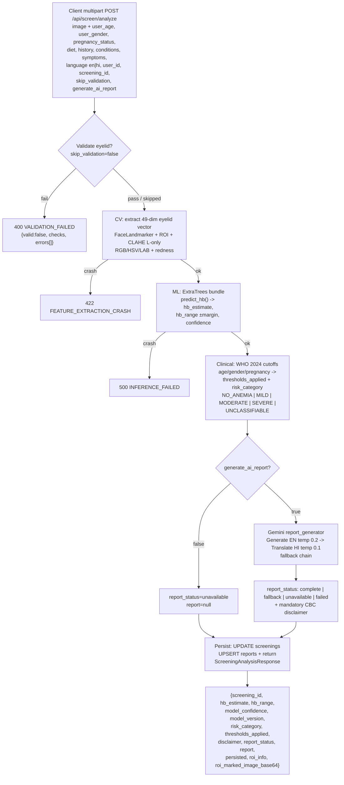
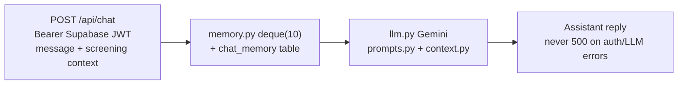

# HemoLens Backend — FastAPI

> **⚠️ MEDICAL DISCLAIMER — READ FIRST**
>
> HemoLens is a **preliminary anemia-risk screening aid only — NOT a diagnosis.**
> It estimates anemia risk from lower-eyelid pallor (+ optional nail-bed image) and
> self-reported health context. **It does not replace a CBC / hemoglobin blood test
> or a clinician's judgment.** Every API response that carries a risk estimate must be
> accompanied by the disclaimer string returned in `disclaimer`, and the AI-generated
> report must instruct the user to get a confirmatory CBC at a lab/hospital.
> **Gemini never classifies anemia risk** — classification is deterministic (WHO 2024
> cutoffs) in `clinical/`. If in doubt, escalate to a clinician.

---

## 1. Overview

FastAPI service (`backend.main:app`, title **HemoLens API v0.1.0**) that powers:

1. **Image validation** — eyelid + nail-bed quality gates.
2. **CV feature extraction** — 49-dim eyelid vector (`eyelid_49_v1`), 21-dim nail vector (`nail_rgb_v1`).
3. **Hb regression** — singleton ExtraTrees bundle (`predictor.py`) → `hb_estimate + hb_range + confidence`.
4. **Deterministic clinical classification** — WHO 2024 thresholds (`anemia_thresholds.py` `who_2024_hb_v1` + `risk_classifier.py`).
5. **AI reports + chat** — Gemini generate-then-translate (`ai/gemini/`) + Supabase-backed chat memory (`ai/chat/`).
6. **Persistence** — backend only `UPDATE`s `screenings` / `UPSERT`s `reports` / appends `chat_memory`. Frontend owns row creation + image uploads.

Base URL (local): `http://127.0.0.1:8000`

Interactive docs: `/docs` (Swagger), `/redoc` (ReDoc), health probe: `GET /health`.

## 2. End-to-End Pipeline



Nail-bed images are **validated + featurized only** (`21-dim`). They are **not wired to Hb regression** (future work).

Chat is a separate path:



## 3. Setup

### 3.1 Prerequisites

- Python 3.10+ (3.11 recommended)
- `pip` + `venv`
- ~500 MB free for MediaPipe task files (auto-downloaded on first run)
- Optional: Supabase project (persistence + chat auth), Gemini API key (AI reports/chat)

### 3.2 Install

```powershell
# from repo root
cd backend
python -m venv .venv
.\.venv\Scripts\Activate.ps1
pip install -r requirements.txt
```

`requirements.txt` highlights:

| Package | Why |
|---|---|
| `fastapi`, `uvicorn[standard]`, `python-multipart`, `pydantic`, `python-dotenv` | API + forms + config |
| `opencv-python-headless`, `numpy`, `mediapipe==0.10.35`, `protobuf` | CV (pin mediapipe — landmarker API breaks on newer) |
| `scikit-learn`, `joblib` | ExtraTrees Hb bundle |
| `google-genai`, `langchain`, `langchain-core`, `langchain-google-genai` | Gemini reports + chat |
| `supabase` | `screenings` / `reports` / `chat_memory` |

### 3.3 Environment

`config.py` loads `.env.local` **then** `.env` (`.env.local` wins). Copy and fill:

```powershell
Copy-Item .env.example .env.local  # if example exists, else create new
```

| Variable | Required | Default / Notes |
|---|---|---|
| `SUPABASE_URL` / `NEXT_PUBLIC_SUPABASE_URL` | For persistence/chat | Either accepted; `config.py` checks both |
| `SUPABASE_SERVICE_ROLE_KEY` | For persistence (server-side) | Never expose to frontend |
| `SUPABASE_ANON_KEY` / `NEXT_PUBLIC_SUPABASE_ANON_KEY` | For JWT verify on `/api/chat` | — |
| `GEMINI_API_KEY` / `GOOGLE_API_KEY` | For AI report/chat | Either accepted |
| `GEMINI_MODEL` | No | `gemini-2.5-flash` |
| `ALLOWED_ORIGINS` | No | `http://localhost:3000,http://localhost:3001,http://127.0.0.1:3000` (see `main.py` CORS) |
| CV thresholds | No | Tunables in `config.py` (see §6); do not set via env unless you know the ROC impact |

> **No secrets in git.** `.env*` is gitignored. This README contains no keys.

### 3.4 Run

```powershell
# from repo root or backend/
uvicorn backend.main:app --reload --port 8000
# docs: http://127.0.0.1:8000/docs
# redoc: http://127.0.0.1:8000/redoc
# health: http://127.0.0.1:8000/health
```

`main.py` lifespan **preloads the Hb model** on startup — first `/analyze` call has no cold-start penalty. CORS defaults allow `localhost:3000,3001` + `127.0.0.1:3000`.

Models (`models/face_landmarker.task`, `models/hand_landmarker.task`) **auto-download on first use** and are **gitignored**. Do not commit them. Delete to force re-download.

## 4. API Reference

All `/api/screen/*` image inputs are `multipart/form-data` with field name **`image`** (or `file` alias where noted). Validators always return **HTTP 200** with `{valid: bool}` — check the body, not just the status.

### 4.1 `GET /health`

```json
{ "status": "ok" }
```

### 4.2 `POST /api/screen/validate-image-eyelid`

Quality gate for the primary lower-eyelid image.

| Item | Detail |
|---|---|
| Consumes | `multipart/form-data`, field `image` |
| Returns | Always `200` → `{valid, message, checks{resolution, blur, brightness, eye_detection, eyelid_visibility}, errors[]}` |
| Fails when | resolution < 400×300, brightness outside 30–235, eyelid Laplacian < 25 @1024px, `EAR < 0.06`, no face/eye landmarks |

Sample request:

```powershell
curl -X POST http://127.0.0.1:8000/api/screen/validate-image-eyelid `
  -F "image=@eyelid.jpg"
```

Sample response (pass):

```json
{
  "valid": true,
  "message": "Eyelid image looks usable.",
  "checks": {
    "resolution": {"pass": true, "width": 1280, "height": 720},
    "blur": {"pass": true, "score": 68.4},
    "brightness": {"pass": true, "mean": 142.5},
    "eye_detection": {"pass": true, "detail": "FaceLandmarker 2 eyes, EAR 0.21"},
    "eyelid_visibility": {"pass": true, "detail": "lower-eyelid ROI found"}
  },
  "errors": []
}
```

Sample response (fail):

```json
{
  "valid": false,
  "message": "Image too blurry — retake in bright diffuse light.",
  "checks": {
    "resolution": {"pass": true, "width": 800, "height": 600},
    "blur": {"pass": false, "score": 11.2},
    "brightness": {"pass": true, "mean": 120.0},
    "eye_detection": {"pass": true, "detail": "FaceLandmarker 2 eyes, EAR 0.18"},
    "eyelid_visibility": {"pass": false, "detail": "lower-eyelid not isolable"}
  },
  "errors": ["BLURRY", "EYELID_NOT_VISIBLE"]
}
```

### 4.3 `POST /api/screen/validate-image-nail` (alias: `POST /api/screen/validate-nail-image`)

| Item | Detail |
|---|---|
| Consumes | `multipart/form-data`, field `image` |
| Returns | Always `200` → same shape as eyelid **plus `nail_count`** |
| Fails when | shared gates fail, skin-masked Tenengrad < 350, `nail_count < 3`, solidity < 0.4 cues fail |

```powershell
curl -X POST http://127.0.0.1:8000/api/screen/validate-image-nail `
  -F "image=@nails.jpg"
```

```json
{
  "valid": true,
  "message": "Nail image usable (4 nails).",
  "checks": {
    "resolution": {"pass": true, "width": 1280, "height": 960},
    "blur": {"pass": true, "score": 512.7},
    "brightness": {"pass": true, "mean": 150.2},
    "eye_detection": {"pass": true, "detail": "n/a for nails"},
    "eyelid_visibility": {"pass": true, "detail": "n/a for nails"}
  },
  "nail_count": 4,
  "errors": []
}
```

### 4.4 `POST /api/screen/extract-eyelid-features`

Debug/inspection endpoint — returns the raw 49-vector without inference.

```powershell
curl -X POST http://127.0.0.1:8000/api/screen/extract-eyelid-features `
  -F "image=@eyelid.jpg"
```

```json
{
  "success": true,
  "feature_vector": [0.61, 0.42, "... 49 floats total"],
  "feature_names": ["r_mean", "g_mean", "... 49 names, eyelid_49_v1"],
  "roi": {"x": 410, "y": 300, "w": 220, "h": 90},
  "references": {"cards": [], "notes": "color-reference hooks reserved"},
  "meta": {"blur": 68.4, "brightness": 142.5, "ear": 0.21}
}
```

On CV crash → `422` with detail `FEATURE_EXTRACTION_CRASH`.

### 4.5 `POST /api/screen/extract-nail-features`

```powershell
curl -X POST http://127.0.0.1:8000/api/screen/extract-nail-features `
  -F "image=@nails.jpg"
```

```json
{
  "success": true,
  "feature_vector": [0.72, 0.55, "... 21 floats total"],
  "feature_names": ["r_p5", "r_p10", "... nail_rgb_v1, 7 percentiles x RGB"],
  "nail_rois": [{"x": 100, "y": 200, "w": 80, "h": 100}],
  "nail_count": 4,
  "per_nail_features": [[0.7, "... 21 floats"], ["..."]],
  "meta": {"tenengrad": 512.7, "brightness": 150.2}
}
```

### 4.6 `POST /api/screen/analyze` — canonical E2E

Combines validate → extract → regress → classify → (optional) Gemini report → persist.

Consumes `multipart/form-data`:

| Field | Type | Notes |
|---|---|---|
| `image` | file | **Required.** Lower-eyelid photo |
| `user_id` | string (Form) | Supabase user UUID (for persistence) |
| `user_age` | int (Form) | Required for WHO cutoffs |
| `user_gender` | string (Form) | `male` / `female` (drives WHO table) |
| `pregnancy_status` | string (Form) | `pregnant` / `not_pregnant` / `unknown`; only matters if female |
| `diet` | string (Form) | Free text, passed to report context |
| `previous_anemia_history` | string (Form) | Free text |
| `medical_conditions` | string (Form) | Free text |
| `symptoms` | string (Form) | Free text |
| `language` | string (Form) | `en` \| `hi` (report language; pipeline is generate-EN-then-translate) |
| `screening_id` | string (Form) | UUID created by frontend; backend `UPDATE`s it |
| `skip_validation` | bool (Form) | Default `false`; `true` bypasses quality gate (debug only) |
| `generate_ai_report` | bool (Form) | Default `true`; `false` skips Gemini |

Success → `200 ScreeningAnalysisResponse`:

```powershell
curl -X POST http://127.0.0.1:8000/api/screen/analyze `
  -F "image=@eyelid.jpg" `
  -F "user_id=<uuid>" `
  -F "user_age=24" `
  -F "user_gender=female" `
  -F "pregnancy_status=not_pregnant" `
  -F "language=en" `
  -F "screening_id=<uuid>" `
  -F "generate_ai_report=true"
```

```json
{
  "screening_id": "<uuid>",
  "hb_estimate": 11.8,
  "hb_range": [8.9, 14.7],
  "model_confidence": 0.72,
  "model_version": "eyelid_hb_v1",
  "risk_category": "MILD",
  "thresholds_applied": {"cutoff": 12.0, "source": "who_2024_hb_v1", "profile": "female, 15y+, not pregnant"},
  "disclaimer": "Preliminary screening only — not a diagnosis. Confirm with a CBC blood test and consult a clinician.",
  "report_status": "complete",
  "report": {"en": "# HemoLens report ...", "hi": null, "sections": ["summary", "what-this-means", "next-steps"]},
  "persisted": {"screenings_updated": true, "reports_upserted": true},
  "roi_info": {"x": 410, "y": 300, "w": 220, "h": 90},
  "roi_marked_image_base64": "/9j/4AAQSkZJRgABAQAA..."
}
```

Errors:

| Status | Code | When |
|---|---|---|
| `400` | `VALIDATION_FAILED` | Quality gate failed and `skip_validation=false`. Fix lighting/focus/framing, retry |
| `422` | `FEATURE_EXTRACTION_CRASH` | ROI/feature code threw (no landmarks, corrupt file) |
| `500` | `INFERENCE_FAILED` | Model bundle missing/corrupt or predict threw |

### 4.7 `POST /api/screen/generate-report` — standalone Gemini

Regenerates a report for an already-analyzed screening (no image needed). Body is JSON with `screening_id`, `hb_estimate`, `risk_category`, health context, `language`. Same `report_status` enum (`complete|fallback|unavailable|failed`) and same mandatory CBC disclaimer. Useful when `/analyze` was called with `generate_ai_report=false` or translation is retried.

### 4.8 `POST /api/chat` + `GET /api/chat/memory`

Conversational assistant grounded in the user's latest screening.

- Auth: `Authorization: Bearer <Supabase JWT>` (anon key verify). **Never returns 500** on auth/LLM failure — returns a safe fallback reply + error hint instead.
- `POST /api/chat` body: `{message, screening_id?, language?}` → `{reply, memory_hit, screening_context_used}`.
- `GET /api/chat/memory` → recent turns (bounded `deque(10)` in-process + `chat_memory` table for cross-session).

```powershell
curl -X POST http://127.0.0.1:8000/api/chat `
  -H "Authorization: Bearer <JWT>" `
  -H "Content-Type: application/json" `
  -d "{\"message\":\"What does MILD anemia risk mean?\",\"language\":\"en\"}"
```

### 4.9 `GET /api/screen/report-image-refs/{screening_id}`

Returns stored ROI / reference artifacts for a screening (used by the report UI). `404` if unknown `screening_id`.

## 5. CV / ML Architecture

### 5.1 Validators (`routers/screen.py` + `cv/`)

Shared gates: **min 400×300**, **brightness mean 30–235**, blur metrics below.

| Path | Detector | Blur / focus | Geometry |
|---|---|---|---|
| Eyelid | MediaPipe **FaceLandmarker** (`models/face_landmarker.task`), Eye-Aspect-Ratio **≥ 0.06**, lower-eyelid ROI isolation | Laplacian variance **≥ 25 @1024px** (resize-normalized so phone sensors compare fairly) | 2 eyes expected; fails closed if no face |
| Nail | Multi-cue (skin mask + contour **solidity ≥ 0.4** + aspect/area filters; hand landmarker as assist) | **Tenengrad ≥ 350 skin-masked** (gradient energy inside skin, not background) | Requires **≥ 3 nails** — fewer is `valid:false` |

### 5.2 Features

| Vector | Version | Dim | Construction |
|---|---|---|---|
| Eyelid | `eyelid_49_v1` (`cv/eyelid_features.py`, ~1100 lines) | **49** | **15 RGB + 15 HSV + 15 LAB + 4 redness**. LAB computed after **CLAHE on L-only** (`clipLimit 2.0`, `tileGrid 8×8`) so contrast is normalized without shifting chroma. Redness = R/G, R/B ratios + normalized-R stats — the pallor signal |
| Nail | `nail_rgb_v1` (`cv/nail_features.py`, ~1230 lines) | **21** | Median across nails of per-nail **7 percentiles × RGB**, sampled from inner **60%×60%** crop of each nail ROI (avoids cuticle/edge glare) |

`feature_names` arrays are returned by both extract endpoints — **log them with every training row** or retrains will silently misalign columns.

### 5.3 Hb Regression (`ml/predictor.py`, `ml/hemolens_predict.py`)

- **Singleton** ExtraTrees bundle loaded once at startup: `{model, calibration_margin ≈ 2.86, error_ceiling ≈ 5.34, model_version}` from `ml/eyelid_hb_model_v1.joblib` (trained in `HemoLens_Hb_Regression_Model_v2.ipynb` — see notebook for data/splits).
- `predict_hb(vector49) → {hb_estimate, hb_range, confidence}` where `hb_range = estimate ± calibration_margin` (clipped at `error_ceiling`).
- Schemas: `ml/schemas.py` (eyelid I/O), `ml/nail_schemas.py` (nail I/O, inference **not wired** — nail vector is extracted + stored for future fusion only).

### 5.4 Clinical (`clinical/`)

| File | Role |
|---|---|
| `anemia_thresholds.py` (`who_2024_hb_v1`) | WHO 2024 Hb cutoffs by age / gender / pregnancy. **Single source of truth** — `thresholds_applied` in every response cites it |
| `risk_classifier.py` | **Pure deterministic** mapping `hb_estimate + thresholds → NO_ANEMIA / MILD / MODERATE / SEVERE / UNCLASSIFIABLE`. No ML, no LLM. `UNCLASSIFIABLE` when age/gender/pregnancy combo has no WHO row |
| `references.py` | Human-readable strings + CBC-disclaimer text |

> **Gemini never classifies.** `ai/` only explains the already-computed `risk_category` and gives next steps.

WHO 2024 cutoffs applied (`who_2024_hb_v1`, g/dL — anemia if Hb **below** cutoff):

| Population | Anemia cutoff | Notes |
|---|---|---|
| Children 6–59 mo | 10.5 | — |
| Children 5–11 y | 11.5 | — |
| Adolescents 12–14 y | 12.0 | — |
| Females 15+ y, not pregnant | 12.0 | — |
| Females 15+ y, pregnant (1st/3rd tri) | 11.0 | Trimester-aware; `unknown` → conservative path → may yield `UNCLASSIFIABLE` |
| Males 15+ y | 13.0 | — |

Severity bands within anemic range are resolved by `risk_classifier.py` (mild/moderate/severe offsets per WHO). See `clinical/anemia_thresholds.py` for exact numbers — this table is a summary, code wins.

### 5.5 AI (`ai/`)

| Module | Behavior |
|---|---|
| `ai/gemini/client.py`, `schemas.py`, `prompts.py` | Low-temp calls: generation `0.2`, translation `0.1`. Prompts force structure + CBC disclaimer + no-diagnosis language |
| `ai/gemini/report_generator.py` | **Generate-then-Translate**: always generates EN first, then translates to HI if `language=hi`. Status: `complete` (Gemini OK) \| `fallback` (template + thresholds, Gemini down) \| `unavailable` (not requested / no key) \| `failed` (both paths failed; `report=null`, clinical result still returned) |
| `ai/chat/service.py`, `llm.py`, `prompts.py`, `context.py` | Chat grounded in latest screening context; refuses diagnosis, pushes CBC |
| `ai/chat/memory.py` | In-process `deque(10)` per user + `chat_memory` Supabase table for persistence |

## 6. Configuration (`config.py`, `main.py`)

- `config.py` loads `.env.local` then `.env`; supports both `SUPABASE_URL` and `NEXT_PUBLIC_SUPABASE_URL`, both `GEMINI_API_KEY` and `GOOGLE_API_KEY`, `GEMINI_MODEL` (default `gemini-2.5-flash`), `ALLOWED_ORIGINS`, and CV tunables (min resolution, brightness bounds, Laplacian/Tenengrad floors, EAR/solidity floors).
- `main.py` sets CORS (defaults `http://localhost:3000`, `http://localhost:3001`, `http://127.0.0.1:3000`), mounts routers (`screen`, `features`, `nail_features`, `analyze`, `report`, `chat`), and preloads the model in `lifespan`.

## 7. Frontend Connection

Backend and frontend are **separate services**. Two wiring modes (both supported):

1. `frontend/next.config.ts` rewrites `/api/*` → backend (same-origin in dev).
2. Direct `NEXT_PUBLIC_BACKEND_URL=http://127.0.0.1:8000` fetches.

Ownership rule: **frontend creates `screenings` rows + uploads images** (Supabase Storage). Backend never creates them — on `/analyze` it only `UPDATE`s the `screenings` row matching `screening_id`, `UPSERT`s `reports`, and appends `chat_memory`. If `user_id`/`screening_id` is missing or Supabase keys are unset, inference still succeeds with `persisted: {screenings_updated: false, ...}` — check that flag in the UI.

`services/persistence.py` encapsulates all Supabase writes so routers stay thin.

## 8. Testing

```powershell
# from repo root — legacy validator print report + full unittest discovery
python test_validator.py
python -m unittest discover -s backend/tests -v

# or targeted pytest (requires pytest installed)
pytest backend/tests -v -s
```

| Test file | Covers |
|---|---|
| `test_validation.py` | Eyelid validator gates (resolution/blur/brightness/landmarks) |
| `test_nail_validation.py` | Nail validator incl. `nail_count ≥ 3` |
| `test_eyelid_features.py` | 49-dim shape, names, CLAHE/redness sanity |
| `test_nail_features.py`, `test_nailbed_features.py` | 21-dim shape, inner-crop, per-nail median |
| `test_persistence.py` | Supabase `UPDATE`/`UPSERT` with mocked client (no live DB needed) |

## 9. Project Structure

```
backend/
  main.py                 # app factory, CORS, lifespan model preload, router mounts
  config.py               # .env.local + .env loader, thresholds, Supabase/Gemini keys
  requirements.txt        # pinned deps (mediapipe==0.10.35)
  routers/
    screen.py             # validate-image-eyelid, validate-image-nail (+alias)
    features.py           # extract-eyelid-features
    nail_features.py      # extract-nail-features
    analyze.py            # POST /analyze (canonical E2E)
    report.py             # POST /generate-report, GET report-image-refs/{id}
    chat.py               # POST /chat, GET /chat/memory (JWT)
  cv/
    eyelid_features.py    # ~1100 lines, eyelid_49_v1 (RGB/HSV/LAB+CLAHE/redness)
    nail_features.py      # ~1230 lines, nail_rgb_v1 (percentiles, inner 60%x60%)
  ml/
    predictor.py          # singleton ExtraTrees bundle loader + predict_hb()
    schemas.py            # eyelid I/O schemas
    nail_schemas.py       # nail I/O schemas (inference not wired)
    hemolens_predict.py   # high-level predict helper used by analyze.py
    eyelid_hb_model_v1.joblib
    HemoLens_Hb_Regression_Model_v2.ipynb  # training notebook
  clinical/
    anemia_thresholds.py  # WHO 2024 who_2024_hb_v1 cutoffs
    risk_classifier.py    # deterministic risk mapping (LLM-free)
    references.py         # display strings + disclaimer
  ai/
    gemini/client.py schemas.py prompts.py report_generator.py
    chat/service.py llm.py prompts.py context.py memory.py  # deque(10)+table
  services/
    persistence.py        # Supabase UPDATE/UPSERT/append wrapper
  models/                 # face_landmarker.task + hand_landmarker.task (auto-dl, gitignored)
  storage/                # eyelid_features/<uuid>/ + nail_features/<uuid>/ local debug dumps
  tests/
    test_validation.py test_nail_validation.py test_eyelid_features.py
    test_nail_features.py test_nailbed_features.py test_persistence.py
```

## 10. Debugging

- **Swagger first:** `GET /docs` → try `/analyze` with `skip_validation=true` to isolate CV vs ML failures.
- **`storage/` dumps:** each extract/analyze writes ROI crops + vectors under `storage/eyelid_features/<uuid>/` and `storage/nail_features/<uuid>/`. Inspect the marked ROI image when `valid:false` or `422` — 90% of failures are framing/lighting, not code.
- **Status-code triage:** `400` = retake photo; `422` = check `storage/` ROI + landmark logs; `500` = check model file present + `predictor.py` singleton loaded (see startup logs).
- **Gemini issues:** `report_status=fallback/unavailable/failed` still returns clinical results — check `GEMINI_API_KEY`, model name, quota. Chat never 500s by design; read the fallback `reply` text.
- **Supabase issues:** `persisted:{...false}` with inference OK → check `SUPABASE_URL` + service-role key + that frontend created the `screenings` row first.

## 11. Deployment Notes (Render / Railway)

- Start: `uvicorn backend.main:app --host 0.0.0.0 --port 8000` (both platforms inject `$PORT` — set `8000` or adapt to `$PORT`).
- Set env vars in dashboard (same names as §3.3); attach a persistent disk/volume if you want `storage/` dumps kept, else they are ephemeral — fine for production.
- First boot downloads `models/*.task` (~tens of MB) and loads the ExtraTrees bundle — allow a long health-check grace period / increase timeout.
- Use `opencv-python-headless` (already in requirements) — no libGL on containers. Keep `mediapipe==0.10.35` pinned.
- CORS: add the Vercel/frontend domain to `ALLOWED_ORIGINS`.
- `/health` is the health-check path. Scale to 1 instance unless you externalize the `deque(10)` chat memory (in-process today).
